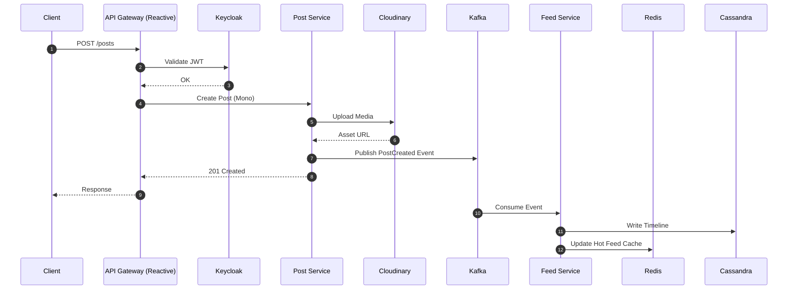
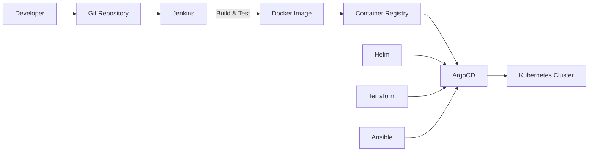

# Social Media Platform – Reactive Microservice Architecture

A high-performance social media backend built with **Reactive Microservices**,
optimized for **low latency**, **high availability**, and **real-time user interaction**.

The system uses **Spring Boot WebFlux** as the primary backend framework and
**FastAPI (Python)** for AI/ML capabilities such as recommendation, moderation,
and behavior analysis.

---

## 1. Key Goals

- **Low latency**: Fully non-blocking reactive stack (WebFlux, Redis, Kafka)
- **High availability**: Kubernetes, multi-node data stores, stateless services
- **Scalability**: Horizontal scaling, event-driven architecture
- **Observability**: Full metrics, tracing, and logging
- **AI-ready**: Dedicated AI inference layer with GPU support

---

## 2. High-Level Architecture

```mermaid
flowchart TB
    %% ===== Clients =====
    subgraph Clients
        Web[Web App]
        Mobile[Mobile App]
    end

    %% ===== Edge Layer =====
    subgraph Edge["Edge / Ingress (Kubernetes)"]
        CDN[Cloudflare / CDN]
        Gateway[API Gateway<br/>(Spring Cloud Gateway - Reactive)]
        WSG[WebSocket Gateway<br/>(Reactive)]
        Keycloak[Keycloak<br/>OAuth2 / OIDC]
    end

    %% ===== Core Services =====
    subgraph Microservices["Reactive Microservices (Spring Boot WebFlux)"]
        UserSvc[User Service]
        PostSvc[Post Service]
        FeedSvc[Feed Service]
        SocialSvc[Social Graph Service]
        MsgSvc[Messaging Service]
        NotifySvc[Notification Service]
        SearchSvc[Search Service]
        MediaSvc[Media Service]
        AdminSvc[Admin Service]
        AnalyticsSvc[Analytics Ingest Service]
    end

    %% ===== AI Layer =====
    subgraph AI["AI / ML Layer (FastAPI)"]
        AISvc[AI Inference Service]
    end

    %% ===== Streaming =====
    subgraph Streaming["Event Streaming"]
        Kafka[Kafka Cluster]
        Flink[Flink / Kafka Streams]
    end

    %% ===== Data Layer =====
    subgraph Data["Data Stores"]
        PG[(PostgreSQL)]
        Cassandra[(Cassandra)]
        Redis[(Redis Cluster)]
        ES[(Elasticsearch)]
        Cloudinary[Cloudinary<br/>Static Assets]
    end

    %% ===== Observability =====
    subgraph Observability
        Zipkin[Zipkin]
        Prom[Prometheus]
        Grafana[Grafana]
    end

    %% ===== CI/CD =====
    subgraph CICD["CI / CD & IaC"]
        Jenkins[Jenkins]
        ArgoCD[ArgoCD]
        Helm[Helm]
        Terraform[Terraform]
        Ansible[Ansible]
    end

    %% ===== Client Flow =====
    Web --> CDN --> Gateway
    Mobile --> CDN --> Gateway

    %% ===== Auth only at Gateway =====
    Gateway --> Keycloak

    %% ===== Internal Trust (No Auth) =====
    Gateway --> UserSvc
    Gateway --> PostSvc
    Gateway --> FeedSvc
    Gateway --> SearchSvc
    Gateway --> MediaSvc
    Gateway --> AdminSvc

    Gateway --> WSG --> MsgSvc

    %% ===== Data Access =====
    UserSvc --> PG
    PostSvc --> PG
    FeedSvc --> Cassandra
    MsgSvc --> Cassandra
    SocialSvc --> Cassandra
    AdminSvc --> Cassandra

    FeedSvc --> Redis
    NotifySvc --> Redis
    WSG --> Redis

    PostSvc --> Cloudinary
    MediaSvc --> Cloudinary

    %% ===== Streaming =====
    PostSvc --> Kafka
    MsgSvc --> Kafka
    NotifySvc --> Kafka
    AnalyticsSvc --> Kafka

    Kafka --> FeedSvc
    Kafka --> Flink
    Flink --> Cassandra
    Flink --> Redis

    Kafka --> AISvc
    AISvc --> Redis

    %% ===== Search =====
    SearchSvc --> ES

    %% ===== Observability =====
    Microservices --> Zipkin
    Microservices --> Prom
    Prom --> Grafana

    %% ===== Deployment =====
    Jenkins --> Helm
    Helm --> ArgoCD
    Terraform --> ArgoCD
    Ansible --> ArgoCD
```

This platform follows a layered architecture:

- **Edge layer** handles authentication, rate-limiting, and routing
- **Reactive microservices** handle business logic
- **Event streaming** decouples services and enables real-time analytics
- **Data layer** is polyglot and optimized per workload
- **AI layer** processes personalization and moderation asynchronously

---

## 3. Technology Stack

### Backend
- **Spring Boot WebFlux** (Reactive, non-blocking)
- **FastAPI (Python)** for AI/ML inference services
- **gRPC** for internal low-latency communication (optional)
- **Kafka** for event streaming

### Authentication & Security
- **Keycloak** (OAuth2 / OpenID Connect)
- JWT validation at API Gateway
- mTLS inside the cluster (via service mesh)

### Data Stores
- **PostgreSQL**
  - User management
  - Account settings
  - Transactional data
- **Cassandra**
  - Feeds & timelines
  - Messaging
  - User interactions
  - Developer dashboard data
- **Redis (Cluster)**
  - Cache (feeds, sessions)
  - Distributed locks
  - Rate limiting
  - Pub/Sub for realtime notifications
- **Elasticsearch**
  - Full-text search
  - Trace & log indexing
- **Cloudinary**
  - Static assets (images, videos)
  - CDN-accelerated delivery

---

## 4. Microservice Overview

| Service | Responsibility | Storage |
|------|----------------|--------|
| API Gateway | Routing, rate limit, auth | — |
| User Service | Profile, privacy, settings | PostgreSQL |
| Post Service | Create/edit posts | PostgreSQL |
| Feed Service | Timelines, feeds | Cassandra, Redis |
| Social Graph Service | Follow relationships | Cassandra |
| Messaging Service | Chat & conversations | Cassandra |
| Notification Service | Push & in-app notify | Redis, Kafka |
| Search Service | Search users/posts | Elasticsearch |
| AI Service | Recommendation, moderation | Redis |
| Admin Service | Developer dashboard | Cassandra |

---

## 5. Reactive Request Flow



Key characteristics:
- All I/O operations are **non-blocking**
- Services communicate using **event streams**
- Redis is used for hot-path read optimization
- Kafka decouples write and fan-out operations

---

## 6. Event Streaming & Analytics

- **Kafka** acts as the central event backbone
- Events include:
  - Post created
  - Like / comment
  - Follow / unfollow
  - Message sent
- **Flink / Kafka Streams**:
  - Real-time aggregation
  - User behavior analysis
  - Feature generation for AI models
- Processed results are written to:
  - Cassandra (materialized views)
  - Redis (hot features)
  - Elasticsearch (analytics & search)

---

## 7. AI / Machine Learning Architecture

- AI services are isolated and implemented using **FastAPI**
- Model serving is stateless and scalable
- Supported use cases:
  - Content moderation
  - Recommendation & ranking
  - User embedding generation
  - Anomaly detection
- Optional components:
  - **MLflow** for model registry
  - **KServe / Seldon** for GPU auto-scaling
  - Feature Store (Feast)

---

## 8. Static Assets & Media Handling

- Media files are uploaded by backend services
- Assets are stored in **Cloudinary**
- Clients receive CDN URLs directly
- Benefits:
  - Reduced backend load
  - Global low-latency delivery
  - Automatic image/video optimization

---

## 9. Distributed Locking Strategy

- Database versioning is **not used**
- **Redis-based locking** is applied for critical sections
- Lock characteristics:
  - `SET NX PX` atomic acquisition
  - TTL to avoid deadlocks
  - Lua script for safe release
- Locks are used for:
  - Idempotent writes
  - Rate-limited operations
  - Critical state transitions

---

## 10. Observability & Monitoring

- **Prometheus**: Metrics collection
- **Grafana**: Dashboards & alerts
- **Zipkin**: Distributed tracing
- **Elasticsearch**: Centralized logs

Key metrics:
- API p95 / p99 latency
- Kafka consumer lag
- Redis hit ratio
- Cassandra read/write latency
- AI inference latency

---

## 11. CI/CD & GitOps



### CI
- **Jenkins**
  - Unit tests
  - Integration tests
  - Docker image build
  - Image scanning

### CD
- **Helm** for application packaging
- **ArgoCD** for GitOps deployment
- **Canary / rolling updates** supported

---

## 12. Infrastructure as Code

- **Terraform**
  - Kubernetes clusters
  - Networking
  - Managed services
- **Ansible**
  - Node bootstrap
  - OS-level configuration
- All infrastructure changes are versioned

---

## 13. High Availability & Scalability

- Stateless services with HPA
- Multi-AZ deployment
- Cassandra multi-node replication
- Redis cluster with failover
- CDN-based media delivery
- Circuit breakers & backpressure handling

---

## 14. Future Improvements

- GraphQL Gateway (Reactive)
- Feature store integration
- Online A/B testing framework
- Multi-region active-active setup
- Advanced content moderation pipeline

---

## 15. License
APACHE
